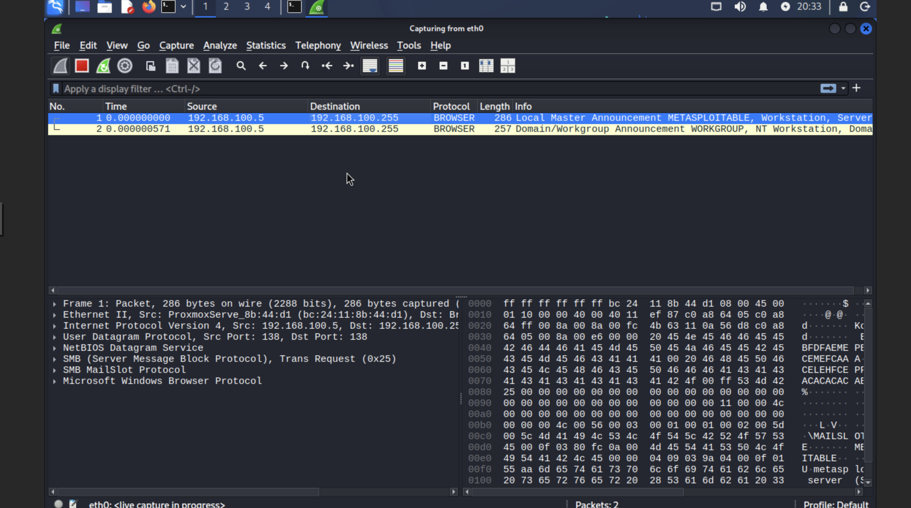
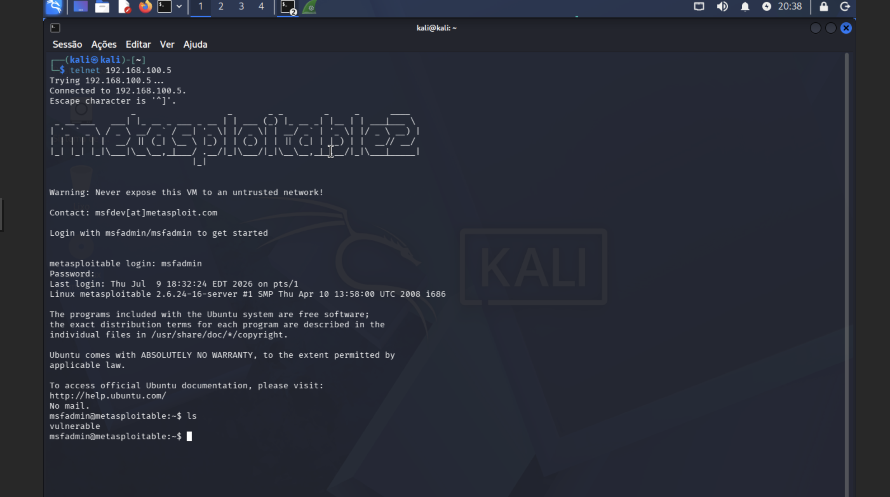
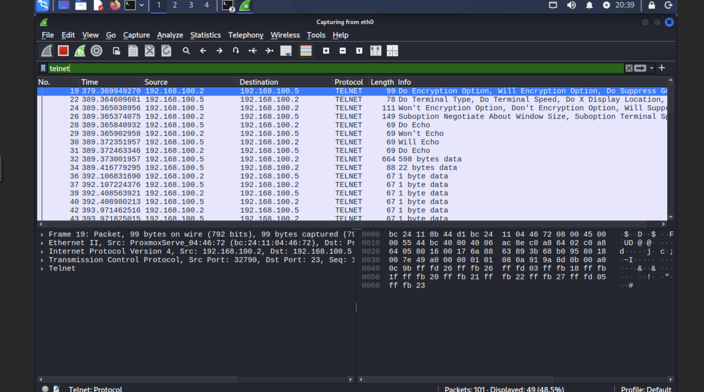
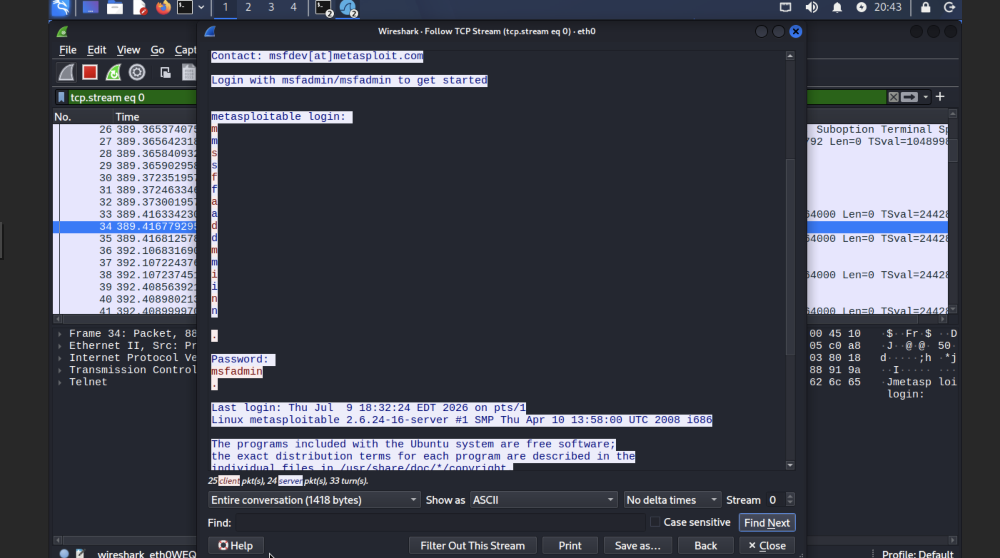
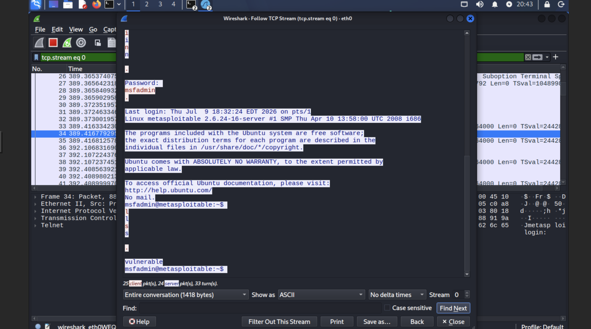

# Writeup 04 — Telnet Credential Capture with Wireshark

**Target:** Metasploitable 2  
**IP:** [TARGET-IP]  
**Port:** 23/tcp (Telnet)  
**Date:** July 2026  
**Author:** Rúben Silva  

---

## Objective

Demonstrate that the Telnet protocol transmits all data — including authentication credentials and session commands — in plaintext over the network. Using Wireshark, capture and reconstruct a complete Telnet session to expose usernames, passwords, and commands in clear text.

This exercise simulates a **passive network eavesdropping** attack — no active exploitation required.

---

## Tools Used

| Tool | Purpose |
|---|---|
| Wireshark | Network traffic capture and analysis |
| Telnet client | Initiating a Telnet session to the target |
| Kali Linux | Attack/monitoring machine |

---

## 1. Background — Why Telnet is Dangerous

Telnet was designed in 1969, before network security was a concern. Unlike SSH (Secure Shell), Telnet transmits **all data in plaintext** — including:

- Usernames and passwords
- Commands executed during the session
- Command output returned by the server

Any device on the same network segment — or any attacker with access to network traffic — can capture and read the entire session without the user's knowledge.

**Telnet was identified during the Nmap reconnaissance phase (Writeup 01)** as running on port 23/tcp of the Metasploitable 2 target.

---

## 2. Environment

| Component | Details |
|---|---|
| Attack/Monitor machine | Kali Linux — [ATTACKER-IP] |
| Target machine | Metasploitable 2 — [TARGET-IP] |
| Network | Isolated LAN (internal bridge) |
| Capture interface | eth0 |

---

## 3. Setting Up the Capture

### 3.1 Launch Wireshark

```bash
sudo wireshark &
```

Select interface **eth0** and start capture by clicking the green shark fin button.

### 3.2 Passive Traffic Already Visible

Even before initiating any connection, Wireshark immediately captured passive broadcast traffic from the Metasploitable target:



**Observed traffic:**
- **SMB BROWSER — Local Master Announcement:** Metasploitable broadcasting its presence on the network as `METASPLOITABLE`
- **SMB BROWSER — Domain/Workgroup Announcement:** Announcing workgroup `WORKGROUP`
- **ARP:** IP-to-MAC resolution between Kali and pfSense gateway

**Key insight:** Without doing anything, the target is already revealing its hostname, workgroup, and service availability to anyone listening on the network. This is passive information leakage.

---

## 4. Initiating the Telnet Session

### 4.1 Connect via Telnet

In a second terminal, while Wireshark continues capturing:

```bash
telnet [TARGET-IP]
```

Login with credentials:
- **Username:** `msfadmin`
- **Password:** `msfadmin`

After login, execute a command:

```bash
ls
```



The session appeared to work normally from the user's perspective — no indication that the traffic was being captured.

---

## 5. Analyzing the Capture

### 5.1 Filter for Telnet Traffic

Apply a display filter in Wireshark to isolate Telnet packets:

```
telnet
```



**Observed Telnet packets:**
- Initial negotiation packets (Terminal Type, Encryption Option, Echo settings)
- Multiple **"1 byte data"** packets — each keystroke transmitted individually
- **"598 bytes data"** — server response (banner + login prompt)
- **"22 bytes data"** — additional server response

The "1 byte data" packets are particularly significant: each character of the username and password was transmitted as a **separate packet**, making it trivial to reconstruct credentials from the capture.

### 5.2 Follow TCP Stream — Full Session Reconstruction

Right-click any Telnet packet → **Follow → TCP Stream**

This reconstructs the entire conversation between client and server:





**Captured in plaintext:**

```
metasploitable login: msfadmin
Password: msfadmin

Last login: Thu Jul  9 18:32:24 EDT 2026 on pts/1
Linux metasploitable 2.6.24-16-server

msfadmin@metasploitable:~$ ls
vulnerable
msfadmin@metasploitable:~$
```

**Total session captured:** 1418 bytes — entire conversation reconstructed, including:
- Login prompt
- Username: `msfadmin`
- Password: `msfadmin` (in cleartext)
- Shell prompt
- Command executed: `ls`
- Command output: `vulnerable`

---

## 6. Attack Chain Summary

```
[1] Wireshark started on eth0 — passive monitoring begins
        ↓
[2] Passive traffic captured — target identity revealed via SMB broadcasts
        ↓
[3] Telnet connection initiated from Kali to [TARGET-IP]:23
        ↓
[4] Credentials transmitted in plaintext:
    → Username: msfadmin
    → Password: msfadmin
        ↓
[5] Wireshark filter: telnet → all packets visible
        ↓
[6] Follow TCP Stream → full session reconstructed
        ↓
[RESULT] Complete credentials and session content captured
         No active exploitation — purely passive attack
         Time to capture credentials: < 30 seconds
```

---

## 7. Severity Assessment

| # | Finding | Severity | Notes |
|---|---|---|---|
| F1 | Telnet transmits credentials in plaintext | 🔴 Critical | Any network observer captures login |
| F2 | All session commands captured in plaintext | 🔴 Critical | Full session visibility for attacker |
| F3 | Passive attack — no active exploitation | 🔴 Critical | Undetectable by target |
| F4 | SMB broadcast leaks hostname and workgroup | 🟠 Medium | Passive information disclosure |
| F5 | Weak credentials (msfadmin/msfadmin) | 🟠 Medium | Default credentials still active |

---

## 8. Recommendations

**R1 — Disable Telnet immediately:**
```bash
# Disable telnet service on Linux
sudo systemctl disable telnet
sudo systemctl stop telnet
```
Telnet has no valid use case in modern environments. There are no scenarios where its continued use is justified.

**R2 — Replace Telnet with SSH:**
SSH provides encrypted transport, strong authentication, and equivalent functionality:
```bash
# Connect securely with SSH instead
ssh msfadmin@[TARGET-IP]
```
All data including credentials is encrypted and cannot be intercepted in transit.

**R3 — Implement network segmentation and monitoring:**
Deploy an IDS/SIEM to alert on Telnet traffic (port 23). Any Telnet traffic in a modern environment should be treated as an anomaly requiring immediate investigation.

**R4 — Enforce strong password policy:**
Default credentials (`msfadmin/msfadmin`) were in use. Implement mandatory password changes on first login and enforce complexity requirements.

**R5 — Disable SMB browsing if not required:**
The target was broadcasting its identity via SMB even without active connections. Disable the SMB browser service if Windows network discovery is not needed.

---

## 9. SSH vs Telnet — Comparison

| Feature | Telnet | SSH |
|---|---|---|
| Encryption | ❌ None — plaintext | ✅ AES, ChaCha20 |
| Authentication | ❌ Password in cleartext | ✅ Password encrypted or key-based |
| Integrity | ❌ No verification | ✅ HMAC |
| Eavesdropping resistance | ❌ Trivially intercepted | ✅ Encrypted end-to-end |
| Year introduced | 1969 | 1995 |
| Recommended for use | ❌ Never | ✅ Always |

---

## 10. References

- [RFC 854 — Telnet Protocol Specification (1983)](https://tools.ietf.org/html/rfc854)
- [NIST SP 800-115 — Technical Guide to Information Security Testing](https://csrc.nist.gov/publications/detail/sp/800-115/final)
- [Wireshark User's Guide](https://www.wireshark.org/docs/wsug_html_chunked/)
- [OWASP — Cleartext Transmission of Sensitive Information](https://owasp.org/www-community/vulnerabilities/Cleartext_Transmission_of_Sensitive_Information)

---

> **Legal disclaimer:** This exercise was performed exclusively on an intentionally vulnerable virtual machine (Metasploitable 2) within a private isolated lab network. All traffic captured belongs to virtual machines under the author's control. No real systems or users were affected.
